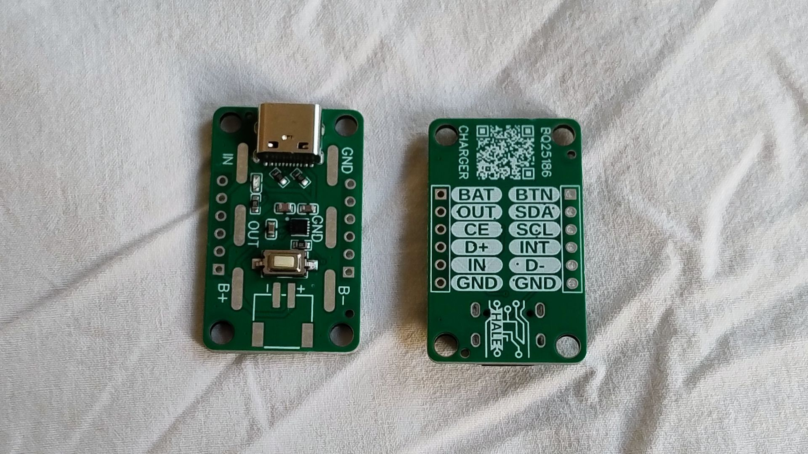
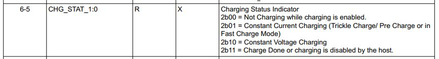

# BQ25186
An Arduino library to support the Texas Instruments [BQ25186](https://www.ti.com/product/BQ25186) "1A I²C-controlled linear battery charger with power path and solar input support" LiPo/LiFePO4 battery charger/power path management IC.

The BQ25186 communicates over I²C allowing you to manage most charging parameters and also manage the power path of your device.

This library was written to support the [BQ25186 breakout board from Hale Ltd](https://www.hale.ltd/p/lipo-charger-v1.html), available on [Tindie](https://www.tindie.com/products/hale/bq25816-lipolifepo4-chargerpower-path-breakout/).



## Installation

This library should be available in the Arduino IDE registry and if you install it directly from there should show any updates as they are released. Alternatively if you choose "Code -> Download ZIP" from GitHub it can then be installed in the Arduino IDE with "Sketch->Include Library->Add .ZIP library".

## Basics

The configuration options of the BQ25186 are quite extensive so I have written several examples to do the absolute basics. You should then use the BQ25186 data sheet and your battery data sheet to change the parameters using these as a starting point.

**It is imperative you configure the charging settings appropriately for your battery otherwise there may be a battery fire! If you are not confident in your ability to do so, do not use this device.**

### Examples

- **set_charging_values** - sets the basic charging parameters for a cell
- **set_output_voltage** - sets the regulated system voltage for your device
- **monitoring** - periodically prints the charging/supply status
- **blink** - blinks an onboard 'power good' LED showing how to use it as a status signal
- **ship_mode** - configures the button so a long press of 5s will put it into 'ship mode', then puts the device into 'ship mode' after 60s. It can be awoken from 'ship mode' with a 2s push of the button or by  connecting a power supply. *Note it will not enter 'ship mode' if a power supply is connected.*
- **shutdown_mode** - configures the button so a long press of 5s will put it into 'shutdown mode', then puts the device into 'shutdown mode' after 60s. It can be awoken from 'shutdown mode' by connecting a power supply. *Note it will not enter 'shutdown mode' if a power supply is connected.*
- **print_registers** - enables debug mode in the library and periodically prints all the BQ25186 registers

## Going further

The BQ25186 has extensive configuration options, set in 14 registers. The first three registers are flags/status and the rest used for configuration. You should use the BQ25186 datasheet as a reference for how to configure it, explaining its use in detail and documenting every single register is beyond the scope of this library.

**It is imperative you configure the charging settings appropriately for your battery otherwise there may be a battery fire! If you are not confident in your ability to do so, do not use this device.**

All the registers are 'bit mapped' meaning each option may use 1-7 bits of a register and all the registers contain more than one value.

For example in the datasheet we have the following for CHG_STAT, which is the charge status value in the first register...



### Read only values/flags

With read-only values I have implemented access to this with a function, named for the lower case version of the 'significant human readable' portion of the name of the value in the data sheet, in lower case. It returns an integer value from a set of constants (done as #defines).

```c++
uint8_t chg_stat();
```

This returns the following values, which again are the 'significant human readable' part of the description prefixed with BQ25186 all in upper case. The error code should be checked for as it means the library has been unable to communicate with the BQ25186 over I²C and you should handle that.

```c++
BQ25186_ENABLED_BUT_NOT_CHARGING
BQ25186_CC_CHARGING
BQ25186_CV_CHARGING
BQ25186_CHARGING_DONE_OR_DISABLED
BQ25186_I2C_ERROR
```

### Read/write values (constant values)

With read/write values I have used the get/set pattern for accessing them usually again using a set of constants (done as #defines) to get or set them. There are a small number of functions such as setting currents/voltages where these are done by directly passing an integer or float to make it more convenient (nobody wants to use one of 127 #defines to set a voltage).

For example in the datasheet we have the following for MR_LPRESS which sets the length of the button 'long press'...


I've implemented the following functions to get/set it...

```c++
uint8_t get_mr_lpress();
bool set_mr_lpress(uint8_t value);
```

With the following options to get or set...

```
BQ25186_MR_LPRESS_5S
BQ25186_MR_LPRESS_10S
BQ25186_MR_LPRESS_15S
BQ25186_MR_LPRESS_20S
BQ25186_I2C_ERROR (on get only)
```

The get function will return BQ25186_I2C_ERROR on an I²C error. The set function will return false on an I²C error.

### Read/write values (numeric values)

An example of a function that passes numerical values directly is the one to set the battery regulation voltage, which is a 7-bit value...


I've implemented the following functions to get/set it...

```c++
float get_vbatreg();
bool set_vbatreg(float voltage);
```

The get function will return zero on an I²C error. The set function will return false on an I²C error.

### Finding these functions (there are many)

All the functions are in the source code in register order, as they appear on the datasheet. Almost all of them are implemented identically and they and the large number of #defined values serve just to make the register twiddling necessary to configure the BQ25186 human readable.

## Version history

- v0.1.0 - Initial release 04/01/2025
